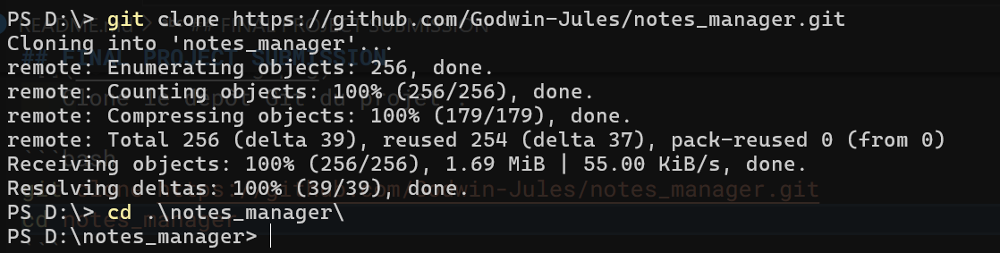
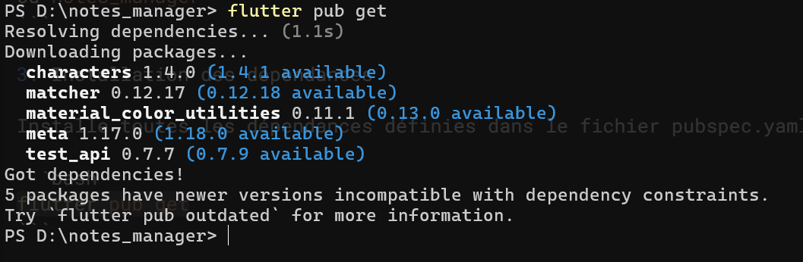
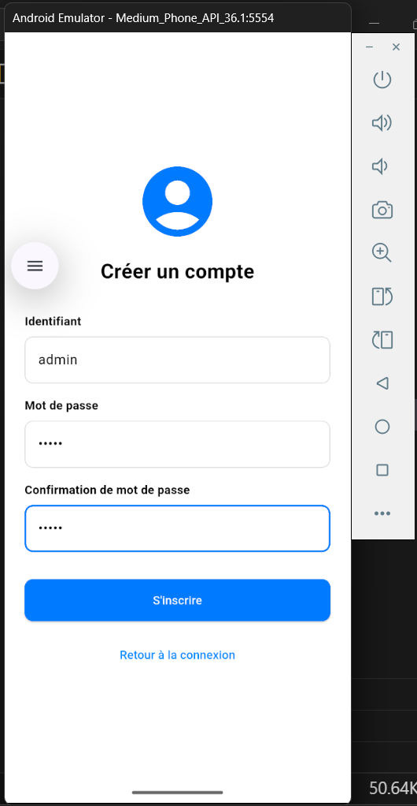
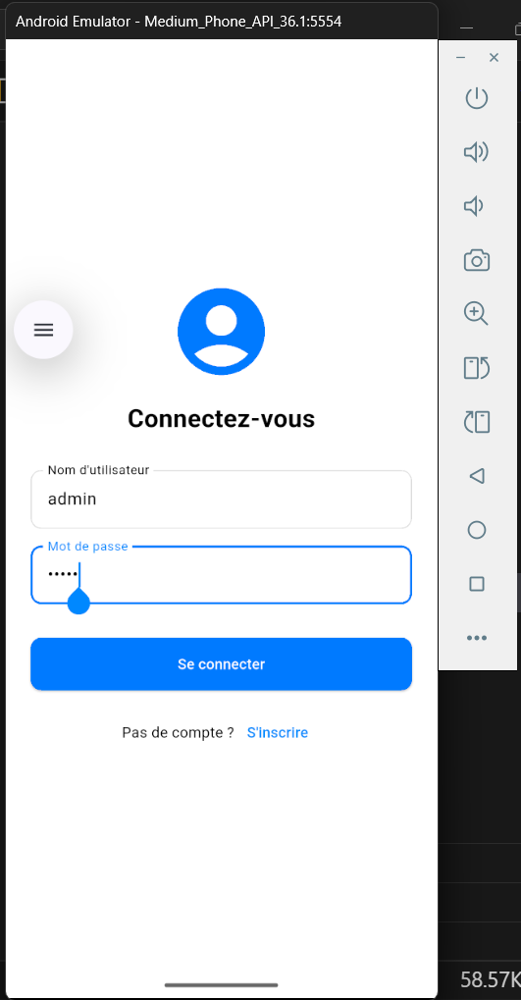
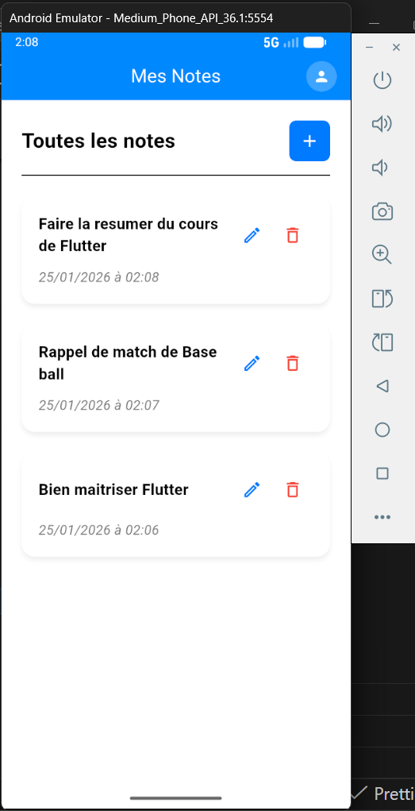
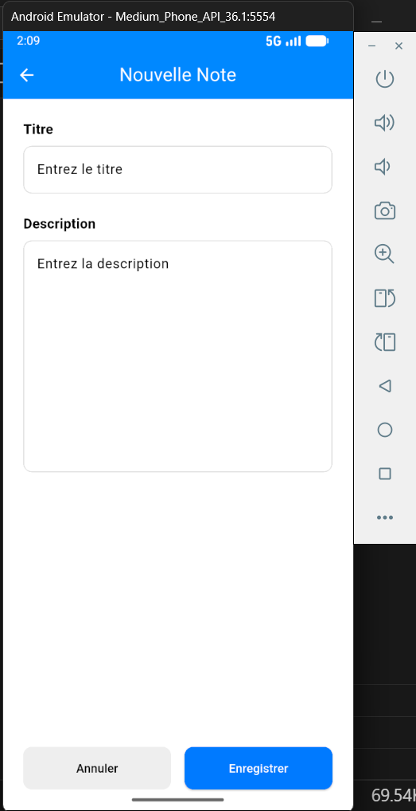
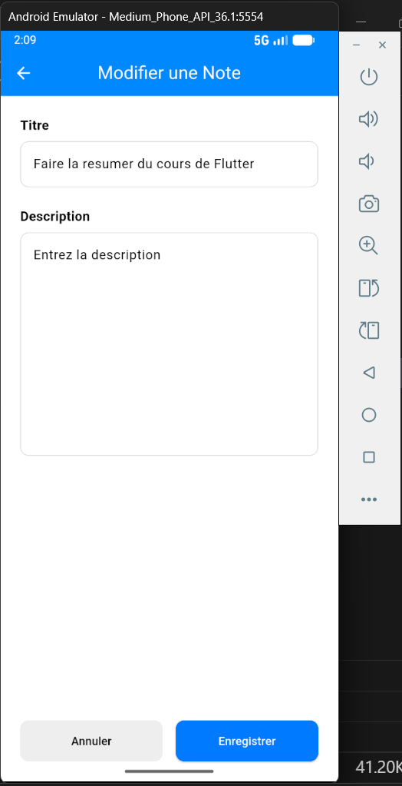
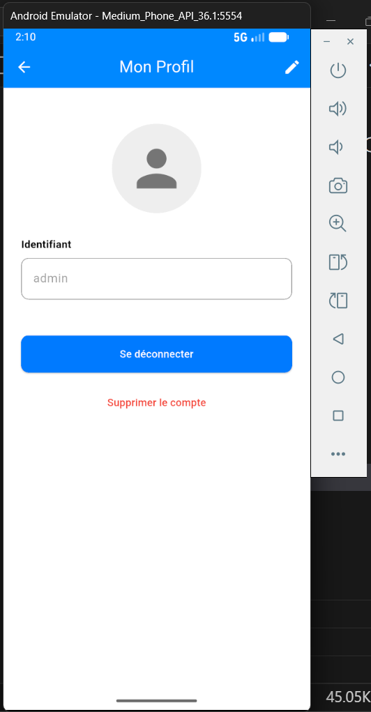
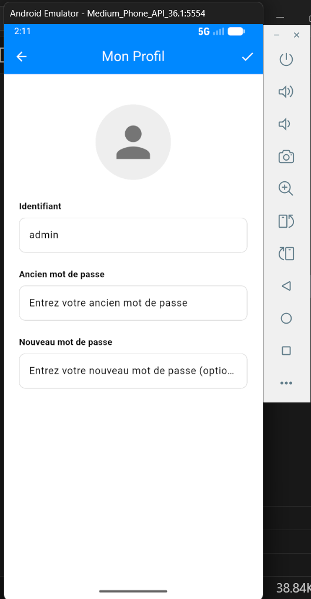

<style>
  .grid {
    display: flex;
    flex-wrap: wrap;
    gap: 20px;
    margin: 20px 0;
    justify-content: center;
  }
  .card {
    flex: 0 0 calc(50% - 20px); /* Force 2 per row */
    display: flex;
    flex-direction: column;
    align-items: center;
    margin-bottom: 20px;
  }
  .card h3 {
    margin: 0 0 10px 0;
    font-size: 1.1em;
    text-align: center;
    width: 100%;
  }
  .card img {
    width: 100%;
    max-width: 500px; /* Slightly smaller to fit 2 per row comfortably */
    height: auto;
    border: 1px solid #ddd;
    border-radius: 8px;
    box-shadow: 0 4px 8px rgba(0,0,0,0.1);
  }
 */
</style>

## FINAL PROJECT SUBMISSION

### Instructions d’installation et d’utilisation du projet

#### 1. Prérequis

Avant d’installer et d’exécuter ce projet, il faut nécessairement ces éléments suivants installés sur votre machine :

- Flutter SDK (version recommandée : 3.38.5 ou compatible)
- Dart SDK (déjà inclus avec Flutter)
- Android Studio ou Visual Studio Code
- Un émulateur Android/iOS ou un appareil physique
- Git (pour cloner le dépôt ou autrement télécharger le code source en format ZIP et le décompresser)

Vérifie l’installation de Flutter avec la commande :

```bash
flutter doctor
```

#### 2. Récupération du projet



Clone le dépôt Git du projet :

```bash
git clone https://github.com/Godwin-Jules/notes_manager.git
cd notes_manager
```

#### 3. Installation des dépendances



Installe toutes les dépendances définies dans le fichier pubspec.yaml :

```bash
flutter pub get
```

#### 4. Lancement du projet

Pour démarrer l'application en mode développement,

```bash
flutter run
```

Pour lancer sur un appareil spécifique :

```bash
flutter devices
flutter run -d <device_id>
```

#### 5. Quelques captures d’écran de l’application

<div class="grid">
  <div class="card">
    
    <h3>Enregistrement</h3>
  </div>
  <div class="card">
    
    <h3>Connexion</h3>
  </div>
  <div class="card">
    
    <h3>Page d’accueil</h3>
  </div>
  <div class="card">
    
    <h3>Création de notes</h3>
  </div>
  <div class="card">
    
    <h3>Modification de notes</h3>
  </div>
  <div class="card">
    
    <h3>Profil utilisateur</h3>
  </div>
  <div class="card">
    
    <h3>Modification du mot de passe</h3>
  </div>
</div>
